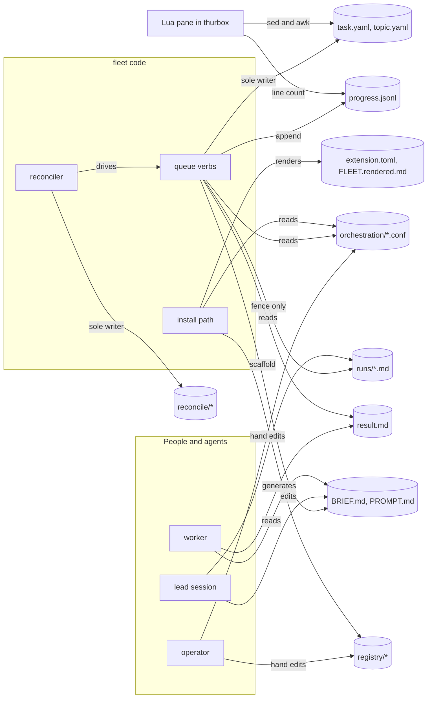
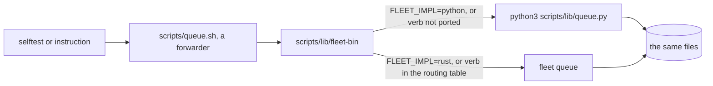
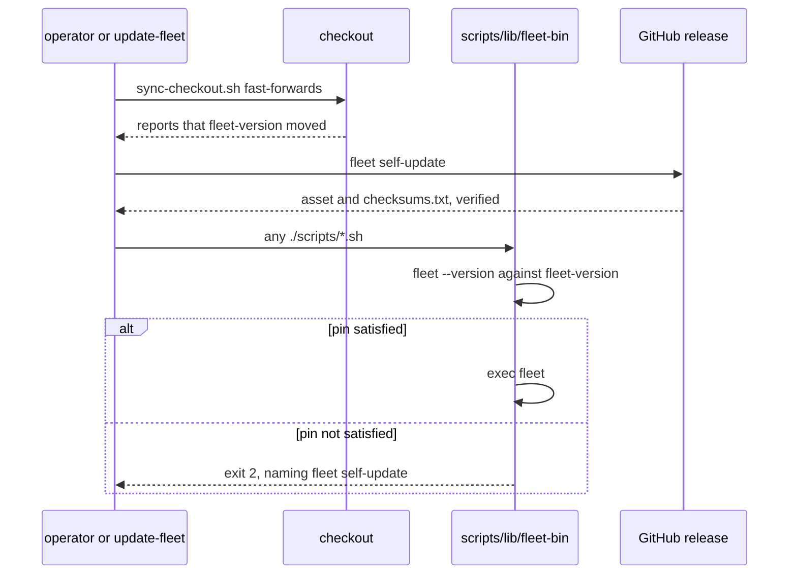
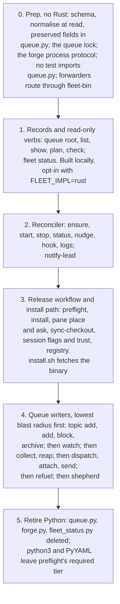

# Fleet in Rust — a design around the files it shares

> **Status: a proposal for review.** No code lands with this document. Every
> decision below can be overturned, and each one that closes off an option says
> so in [the lock-in register](#12-lock-in-register).

The short version: fleet becomes one binary, `fleet`, that is **one more reader
and writer of the files fleet already keeps**, not their new owner. The files
keep their paths, their formats and their human readers. Every `scripts/*.sh`
entry point stays as a forwarder. The port is a strangler: it starts with the
code that only reads records, proves each subcommand against the existing bash
selftests under both implementations, and retires `queue.py` writer by writer.

## The decisions on one page

| Question | Decision | Where |
|---|---|---|
| What the contract is | The files on disk, down to the line shapes other readers parse. The binary is one reader and writer among several | §2.1, §3 |
| Schema evolution | `schema:` on every record; normalise once, at the read boundary; unknown fields survive a rewrite; migrate lazily on write; never write a record newer than the binary | §2.2 |
| Script paths | Every entry point in `scripts/` stays as a forwarder, and during the port routes each verb to one implementation | §2.3 |
| Crate shape | One crate, library plus binary, in this repository under `crates/fleet/`; modules mirror today's seams | §5 |
| thurbox coupling | Shell out to `thurbox-cli` behind a trait. Do not link the `0.0.0-dev` crate | §4 |
| Seams | Traits for forge, agent, thurbox, host transport and quota. Out-of-tree forges become executables speaking JSON, replacing Python plugin files | §4 |
| CLI | AXI: TOON by default, `--json` frozen where something already parses it, `fleet` alone shows status, help examples executed in CI | §6 |
| Tests | The bash selftests are the conformance suite. `FLEET_IMPL` points them at either implementation, and a verb switches only when its sections pass under Rust | §7 |
| Portability | std plus a short crate list replaces `timeout`, `jq`, `sed`, `find`, `mktemp` and `date`. `git`, `ssh`, `gh`, `glab`, `thurbox-cli` and `quota-axi` stay processes. Windows is pending on `remote-host-support/02-02` | §8 |
| Distribution | Prebuilt binaries from fleet's own release workflow, modelled on thurbox's. The checkout pins the version it was written for. `update-fleet` is a fast-forward, then a fetch of the pinned binary | §9 |
| Port order | Prep in Python → records and read-only verbs → reconciler → release and install path → queue writers, lowest blast radius first → retire Python | §10 |

## 1. Where fleet is

The lead measured these for this task:

- 24.5k lines of shell and Python: 25 `.sh` files (14,685 lines) and 6 `.py`
  (9,812), plus 2,726 lines of Lua.
- `scripts/lib/queue.py` alone is 6,846 lines, and its selftest 6,248.
- Shell-outs across the scripts: `sed` 108, `timeout` 104, `jq` 83, `ssh` 81,
  `find` 29, `mktemp` 25, `tmux` 10, `awk` 9.
- On 2026-09-12 a fresh Debian box stopped `install.sh` for want of PyYAML.

Added for this document, from the operator's live control plane on 2026-09-12:

- **The corpus.** 68 topics and 83 task records, 59 of the topics archived.
  Those are the records any new reader must load.
- **Script paths in instructions.** 24 live `BRIEF.md` files name
  `scripts/queue.sh`. At `ec90ced4`, the tracked instructions, hooks, gate
  config, README and CONTRIBUTING name a script by path 275 times, 71 of them
  `queue.sh`.
- **thurbox.** `thurbox-cli` 2.20.0 is installed; the extension manifest
  requires at least 2.19.0.
- **The shim already exists.** `scripts/queue.sh` is a header followed by a
  dozen lines that end in `exec python3 scripts/lib/queue.py "$@"`, so the
  forwarding pattern rule 3 needs is one fleet already uses.

thurbox is Rust. Its `cd.yml` builds x86_64 Linux (gnu and musl), x86_64
Windows (msvc) and arm64 macOS, and publishes to winget, Chocolatey, Homebrew
and AUR. Its crate is `0.0.0-dev` and not on crates.io. The Lua pane runs inside
thurbox and is not part of this port.

## 2. The three framing rules

All three are accepted. Each turns out to be stricter than its one-line
statement, and the rest of the design follows from those details.

### 2.1 The files are the contract

Accepted. The binary owns no store, keeps no authoritative cache, and never
makes a file binary-only.

In practice the rule means more than "keep them YAML": **the pane parses
`task.yaml` with `sed` and `awk`**, line by line, in the `PROBE` inside
`interface/fleet_queue.lua`. It reads:

- the `title:` and `archived:` lines of `topic.yaml`;
- timestamps only when single-quoted (`^created: '…'$`);
- the `publish:` block by its two-space indent, for `method:`, `state:` and
  `at:`;
- blockers as `- task:` or `- condition:` lines, each followed by an indented
  `kind:`.

So the contract includes the **shape** of what PyYAML's
`safe_dump(sort_keys=False, default_flow_style=False)` writes today:
insertion-ordered fields, sequences not indented under their key, and
timestamp-like strings single-quoted. A generic serializer that indents
sequences or drops those quotes breaks the pane silently. Nothing crashes and
nothing draws wrong; the task simply stops being drawn.

Decisions:

- **Records are read with a YAML parser and written by a small emitter of
  fleet's own.** Records are shallow: scalars, lists of scalars, one level of
  mapping, a list of small mappings. The emitter is correspondingly small, and
  golden tests pin its output byte for byte against what `queue.py` writes for
  the same document. Its profile is documented beside it and in
  `orchestration/queue/README.md`, so a third writer can match it.
- **One writer per record, as today.** `queue.sh` alone writes `task.yaml` and
  `topic.yaml`, the reconciler writes only its own directory, and a worker
  writes only `result.md`. The binary inherits that split rather than merging
  it.
- **Writes stay atomic** (write `<file>.tmp`, then rename, as `write_yaml`
  does), and `progress.jsonl` stays append-only.
- **A queue write lock, introduced in Python first.** Today nothing stops the
  reconciler's `collect` and the lead's `dispatch` from rewriting the same
  `task.yaml` at once; the last rename wins. Two implementations running side by
  side make that race likelier. So both take an advisory exclusive lock on
  `orchestration/queue/.lock` (std's `File::lock`; `fcntl.flock` in Python).
  The lock covers only a read-modify-write of one record, and is never held
  across a network or process call. A verb that asked the forge re-reads the
  record once the answer is in and writes only the fields it owns. A person
  editing a record by hand does not take the lock, and does not need to: it
  protects writers from each other, not records from people.

### 2.2 Records outlive the code: schema evolution

Accepted, and built first.

The live failure: #74 renamed the publish method `no-mistakes` to `attested`.
`publish_method()` folds the old word through `PUBLISH_ALIASES` wherever a
method is used, but `cmd_check` compares the raw `pub["method"]` against
`PUBLISH_METHODS`. So 23 archived records failed `check.sh`. The bug was not a
missing alias. Normalisation happened where each value was used, not once when
the record was read, so one reader could skip it. `queue-check-alias/01-01` is
fixing that instance in Python; this section is about the class.

The design:

1. **Every record carries `schema: <n>`.** Absent means 0, which is every record
   written so far. The pane's `awk` collects every top-level `key: value` line
   into a map, so one more top-level key is invisible to it. `cmd_check` only
   checks for required keys, so Python tolerates it too.
2. **Normalise once, when the record is read.** Reading is parse, then migrate
   from the record's schema up to the current one, then fold aliases, then
   build the typed value. Nothing after that step ever sees a raw document, the
   validator included. The alias table is data (`field`, `old`, `new`,
   `since`), with one test per row that loads a fixture carrying the old
   spelling.
3. **Unknown fields survive a rewrite.** Every record type keeps a
   `#[serde(flatten)]` map of extra fields and writes it back. Without this,
   whichever implementation is older silently deletes the fields the newer one
   added, in both directions, for as long as the port lasts.
4. **Migration is lazy.** A record is upgraded when something writes it for
   another reason, and never in a sweep. Archived records stay byte-identical,
   so an upgrade does not rewrite the operator's history.
5. **A record newer than the binary is read-only.** A binary that meets a
   `schema` above its own maximum still reads what it can for `list` and
   `show`, and marks the record `newer`. It refuses to write it, with an error
   naming the upgrade command. `check` reports such a record without failing on
   it.
6. **The corpus is a test input.** Sanitised copies of real historical record
   shapes go under `scripts/fixtures/records/`, one directory per shape that
   ever shipped. `fleet queue check --corpus <dir>` runs the same load over an
   operator's own queue, read-only. A rename like #74 then shows up as a
   failing fixture before it can fail on an archive.

Files written by workers get the most tolerant reader of all. An agent writes
`result.md` by hand, so its frontmatter parser accepts whatever `collect`
accepts today. Anything else is reported as `unreadable`, a third answer that
is neither pass nor fail.

### 2.3 Instructions name scripts by path

Accepted. The compatibility story is **forwarders, kept**. A path string lives
in more places than one commit can update:

- the frozen context of every running lead and worker;
- 24 live briefs, which are records and are never rewritten;
- `~/.config/thurbox/hooks/claude.json`, where the operator pasted what
  `reconcile.sh hook` printed;
- `.claude/settings.json` (`sync-checkout.sh`), plus `.no-mistakes.yaml` and
  the prek hooks (`check.sh`);
- the pane's `PROBE`, which runs `./scripts/queue.sh root` and
  `./scripts/fleet-status.sh --fuel` from a copy installed into thurbox's
  plugin directory. That copy stays old until `plugin sync`.

So each `scripts/<name>.sh` that is an entry point becomes, and stays:

```sh
#!/usr/bin/env bash
# Usage lives in `fleet queue --help`. This file exists because instructions,
# briefs and hooks name it by path, and it is kept for as long as any may.
exec "$(dirname "${BASH_SOURCE[0]}")/lib/fleet-bin" queue "$@"
```

`scripts/lib/fleet-bin` finds the binary (§9) and, during the port, routes each
verb to one implementation (§7). A forwarded call prints exactly what the
ported verb prints. The parity rule, not the forwarder, is what keeps an
instruction that quotes that output true.

Not decided: whether a forwarder is ever removed. Keeping one costs a few lines.
Removing one needs proof that no brief, hook or pasted config names it, and no
check can find a string the operator pasted into a config fleet never sees.

The headers are the other half. Today a script's header is both its usage and
its rationale, and the skills say "its header is the full usage". After a verb
is ported:

- usage moves to `fleet <cmd> --help`, with worked examples;
- rationale moves to the module's `//!` doc comment, still beside the code;
- `AGENTS.md` and the skills are repointed in the same pull request.

## 3. Inventory of on-disk state

`.gitignore`'s header puts every ignored path in one of three classes:
GENERATED, MACHINE or WORKING STATE. The tables below keep those words. "Rust"
says what the binary does with the file. Paths are relative to the
control-plane checkout unless they start with `~`.



### Queue records: `orchestration/queue/<topic>/`

| Path | Class | Written by | Read by | Rust |
|---|---|---|---|---|
| `PROMPT.md` | working state | `topic add`, verbatim | lead, operator | Writes it once; never parses or rewrites it |
| `topic.yaml` | working state | `topic add`; `archive` and `unarchive`; `add` clears `archived` | every queue verb; the pane (`sed` for `title` and `archived`); `fleet_status.py` | Typed record with `schema` and preserved extra fields; the emitter profile of §2.1 |
| `<task>/task.yaml` | working state | queue verbs only: `add`, `dispatch`, `attach`, `send`, `watch`, `collect`, `reap`, `shepherd`, `refuel`, `block` | queue verbs; the pane (`sed` and `awk` on line shapes); `fleet_status.py`; agents and people reading the index | Sole writer, under the queue lock, atomically; rewrites the header comment as today |
| `<task>/BRIEF.md` | working state | `add` scaffolds it (or takes `--brief-file`); the lead edits it | the worker, by absolute path (copied to a remote host with `ssh … 'cat >'`); `add` and `dispatch` check its four headings | Scaffold and structural check; never rewritten after the scaffold |
| `<task>/progress.jsonl` | working state | `watch` (transitions), `collect` (publish observations), `shepherd` (merge observations) | `watch`, which resumes from the task's own last `seq`; `list` and `show`, comparing against a `send`; the pane, which counts lines | Append-only, one object per line; a torn last line is skipped and reported; fields are added, never removed |
| `<task>/result.md` | working state | the worker; for a remote task, `collect` fetches it back into place | `collect` (frontmatter `outcome` and `artifact`); the pane (whether it exists); the lead | The most tolerant reader (§2.2); written only by the remote fetch |
| `README.md`, `POLICY.md`, `OPERATOR.example.md` | tracked | people | workers, through the brief's pointer to `POLICY.md`; people | Never read; `add` only names `POLICY.md`'s path |
| `OPERATOR.md` | working state | the operator | workers, when a brief points at it; `add`, which checks it exists and is not empty | Existence check only |
| `.lock` (new) | machine | any queue writer, for one read-modify-write | queue writers | §2.1 |

### Run logs: `orchestration/runs/`

| Path | Class | Written by | Read by | Rust |
|---|---|---|---|---|
| `_TEMPLATE.md` | tracked | people | `topic add` | Template, with the placeholders `<YYYY-MM-DD>` and `<slug>` |
| `<date>-<topic>.md` | working state | the queue, between `<!-- fleet:facts -->` and `<!-- fleet:facts:end -->`; the lead, everywhere else | lead, operator | Byte-identical outside the fence; a file with no fence is left alone, as today; atomic replace |

The run log is the one file two writers share by design, and today's rewrite
can lose an edit. An editor holding the file open writes back the old fence, or
the queue replaces the file under a lead that is mid-edit. The binary keeps the
current behaviour and adds one check: just before the rename, the file must
still hash to what it was when the new fence was computed. If not, it retries
once and then reports. Whether that is worth having is open (§13).

### Reconciler runtime: `orchestration/reconcile/`

This is machine state. Only the reconciler writes it, and none of it is a
record.

| Path | Format today | Written by | Read by | Rust |
|---|---|---|---|---|
| `pid` | the supervisor's pid, one line | supervisor, at start | `status`, `ensure` and `stop` (`kill -0`, plus an argv check against a reused pid) | Still written, for people and scripts. Whether the loop is alive comes from a lock it holds on `reconcile/lock` instead: a lock dies with its process, so there is no stale pid to second-guess, on Unix or on Windows |
| `heartbeat` | epoch seconds | the loop, every tick | `status` (its stalled threshold) | Same format |
| `reconcile.log` | `[ISO-8601] message` lines, appended | the loop | people; `logs -f` | Same format; rotation is open (§13) |
| `nudge` | `nudged <ts> by <session>` | `reconcile.sh nudge`, from a worker's Stop hook | the loop, which consumes and deletes it | Same format. The hook keeps naming `scripts/reconcile.sh nudge` (§2.3) |
| `down` | its presence | `stop`; `start` clears it | `ensure` | Same |
| `notified.json` | `{"told": [...], "note": "..."}` | `notify_lead.py`, best effort | `notify_lead.py` | Same shape, still best effort |

### First-run state: `orchestration/first-run/`

| Path | Class | Written by | Read by | Rust |
|---|---|---|---|---|
| `pane` | machine | `pane-ask.sh`: `yes`, `no`, or `placed` when the layout already places the pane | `pane-ask.sh`, whose first output word is the answer; `install-selftest.sh` | `fleet pane ask`; same file, same words |

### Operator configuration: `orchestration/`

One function, `read_kv_conf`, reads every `*.conf`. The format is `KEY=value`
lines and `#` comments, with no quoting; nothing executes it. The reader takes
the operator's copy when it exists and the tracked `*.example.conf` otherwise.
`auto-merge.conf` is the exception, with one host-qualified repository per line.
The Rust reader is the same parse. "Read as data, never executed" stays a rule:
no forwarder, and nothing else, ever sources a `.conf` in a shell.

| Path (beside its tracked example) | Keys | Read by today | Rust |
|---|---|---|---|
| `publish.conf` | `METHOD`, `HOW`, `ATTESTATION_MARKER`, `PIPELINE_COMMIT_PREFIX` | `add`, `collect`, `shepherd` | Configures the `Publish` shape check. `HOW` stays free text and is never parsed |
| `agent.conf` | `AGENT`, `FUEL_PROVIDER`, `LIMIT_BANNER`, `TRANSCRIPT_DIR`, `TRUST_SIGNATURE`, `TRUST_KEYS`, `AGENT_PROVIDERS` | spawns; `refuel`; `session-trust.sh`; `install-extension.sh` (the lead's agent) | Configures the `Agent` seam. Built-in entries stay one per agent fleet has watched |
| `auto-merge.conf` | repository lines; `FLEET_AUTO_MERGE_REPOS` replaces them | `shepherd`, every pass; `check.sh automerge` | Same parse; a bare `owner/repo` is refused |
| `voice.conf` | `OPERATOR_NAME`, `ASSISTANT_NAME` | `install-extension.sh`; `check.sh voice` | Rendering step of `fleet install` |
| `session-glyphs.conf` | `GLYPHS`, `LEAD_GLYPH_ON`, `LEAD_GLYPH_OFF`, `WORKER_GLYPH_ON` | `install-extension.sh` (the lead's name); `queue.py` (workers' names) | Same two readers, one parse |
| `session-profiles.yaml` | tracked, edited in place | `session_profiles.py`, `session-flags.sh`, `dispatch` | Read only |
| `playbooks/*.md` | tracked | the lead | Never read |

### Registry: `registry/`

| Path | Class | Written by | Read by | Rust |
|---|---|---|---|---|
| `owners.txt` | working state | the operator; `add-owner.sh` appends, keeping header and order | `sync-registry.sh`, `discover-owners.sh`, `add-owner.sh`, `preflight.sh`, onboarding | Same line format |
| `repos.generated.yaml` | generated | `sync-registry.sh`, rebuilt wholesale from every `gh` account | `check_yaml.py` (its shape); the lead and agents | `fleet registry sync` regenerates it. No `sed` reads it, so a serializer is fine; keys and order are kept anyway |
| `context/*.md` | working state | people, the lead | agents | Never read or written |

### Rendered extension

| Path | Class | Written by | Read by | Rust |
|---|---|---|---|---|
| `extension.toml.in` | tracked | people | `install-extension.sh`; `queue.py`, as the fallback for the lead's name | Template input |
| `extension.toml` | machine | `install-extension.sh` (`__REPO_PATH__`, `__LEAD_GLYPH__`, `__LEAD_AGENT__`) | thurbox (`extension install`, and `extension update` re-reads it); `notify_lead.py` and `queue.py` through `manifest_session` (the lead's name, the control-plane guard) | `fleet install` renders it, with the same placeholders |
| `FLEET.rendered.md` | generated | `install-extension.sh` (`@OPERATOR_NAME@`, `@ASSISTANT_NAME@`) | thurbox, as the extension's `[[files]]` payload | Same |
| `__pycache__/` | generated | Python | nobody | Gone with the Python |

### Outside the checkout

These files belong to someone else. The binary keeps today's rule: read what
it must, write only through the owner's intended mechanism, and print rather
than install anything the owner rewrites.

| Path | Owner | fleet today | Rust |
|---|---|---|---|
| `~/.config/thurbox/hosts.toml` | thurbox | `queue.py` parses it with `tomllib` for a host's entry and its `multiplexer` | This couples fleet to a file format, not to a CLI. Keep it behind the `Thurbox` trait, and ask thurbox for a `host list --json` or equivalent so it can move to the CLI |
| `~/.config/thurbox/hooks/claude.json` | thurbox | `reconcile.sh hook` prints the block and never writes it | Same |
| `layout.lua`, in thurbox's interface directory | the operator | `place-pane.sh` writes a guarded block after a yes and a backup, then verifies with `lua` and `plugin check` | Same steps; `lua` stays an external check |
| `plugins.toml` and plugin files | thurbox | `thurbox-cli plugin install` and `remove` | Same |
| `<TRANSCRIPT_DIR>/<agent_session_id>.jsonl` | the agent | `refuel` reads rate-limit records | Same, through the `Agent` seam |
| `<worktree>/BRIEF.md` and `result.md` on a remote host | that host | copied with `ssh … 'cat >'`, fetched with `ssh … cat` | Same, through the `Host` seam |

## 4. Seams stay seams

`scripts/lib/forge.py` sets the bar:

- an interface shaped as questions (`get`, `state`, `open_change_requests`,
  `can_push`, `merge`, …);
- every answer allowed to be "could not tell";
- two implementations;
- a selftest that drives the second with `gh` on `PATH` as a tripwire.

Every seam in the binary is held to it.

| Seam | Implementations shipped | Configured by | Test double |
|---|---|---|---|
| `Forge` | GitHub through `gh`; GitLab through `glab`, with hosts from `glab auth status` | the host in a `RepoId`; `GH_HOST`, `GITLAB_HOST` | stub CLIs on `PATH`; an external forge process |
| `Agent` | one entry per agent fleet has watched: limit banner, transcript layout, trust dialog | `agent.conf` | an `agent.conf` describing a fake agent, as selftest §12b does |
| `Publish` | the closed set of shapes `pr`, `attested` and `push`. An enum, not a trait: a shape is a fact about an artifact, and the tool is free text | `publish.conf` | fixtures |
| `Thurbox` | `thurbox-cli`, as a process | `PATH`; `min_thurbox_version` | a stub `thurbox-cli`; `FLEET_QUEUE_WATCH_CMD` |
| `Host` | local; or ssh, through a POSIX login shell for lookups and without one for copying bytes | the host's entry in `hosts.toml` | a stub `ssh` |
| `Quota` | `quota-axi` | `FUEL_PROVIDER`, `AGENT_PROVIDERS` | a stub `quota-axi` |

Three decisions follow.

**"Could not tell" is in the type.** Every seam method returns its answer or a
reason, as `Result<T, CouldNotTell>`, and nothing converts a reason into a
verdict. `forge.py` says a timeout must never be able to manufacture a merge;
in Rust, code that tried would not compile.

**Out-of-tree forges become processes.** Today `FLEET_FORGE_PLUGINS` names
Python files that export `forges()`, and the selftest drives the whole queue
through one of them. A binary cannot load Python. The variable keeps its
meaning — a forge that is not fleet's business to ship — but each entry names
an executable instead. The executable reads one JSON request on stdin and
writes one JSON answer on stdout, the way git's credential helpers work:

```json
{"protocol": 1, "question": "state", "change": {"host": "forge.test:8443", "path": "acme/widgets", "number": 7}}
```

```json
{"answer": "merged"}
```

```json
{"could_not_tell": "forge.test:8443 did not answer within 10s"}
```

The question names are `forge.py`'s method names. The protocol is built in
Python first, so the selftest's fake forge becomes a script both
implementations call, and §13 and §14 of `queue-selftest.sh` stay neutral
between them. The protocol is a public contract from the day it ships, and the
`protocol` field is how it grows.

**thurbox stays a process.** fleet shells out to `thurbox-cli` and reads its
`--json` output; `min_thurbox_version` in the manifest sets the version floor.
fleet does not link the `0.0.0-dev` crate: its API is unstable, so any thurbox
commit could break fleet's build, and fleet's releases would pin a thurbox
commit rather than a thurbox release. A shared crate needs three things first:

1. thurbox publishes a versioned crate. The likely candidate is a small
   `thurbox-protocol` holding the types of `session list --json`,
   `session get --json` and `watch --json`, not the application.
2. That crate follows semver, so fleet can require a range of it.
3. There is a concrete reason, such as a JSON shape drift that broke fleet, or
   parsing cost that is actually measurable.

Until then, a `thurbox_json` module in the adapter declares the fields fleet
reads. A contract test parses output recorded from the oldest and the newest
supported `thurbox-cli`.

## 5. Crate shape

**One crate, library plus binary, in this repository**: `crates/fleet/`, with
`src/lib.rs` and `src/main.rs`, under a workspace `Cargo.toml` at the root so a
second crate can join without moving anything. Edition 2024.

```text
crates/fleet/src/
  main.rs        argv to command, AXI rendering, exit codes
  lib.rs
  paths.rs       checkout root, queue root (FLEET_QUEUE_DIR, …), control-plane guard
  records/       schema, migrations, aliases, emitter, corpus loader — depends on nothing
  conf.rs        read_kv_conf, example fallback, the auto-merge list
  seams/         forge/, agent.rs, publish.rs, thurbox.rs, host.rs, quota.rs
  queue/         intake, plan, dispatch, watch, collect, reap, shepherd, refuel
  reconcile/     supervisor, loop, notify
  status.rs      fleet-status: reads, degrades, never fails
  install/       preflight, render, pane placement, pane ask, sync-checkout
  registry/      sync, discover owners, add owner
  axi.rs         TOON and JSON output, structured errors, help examples
```

**Why one crate and not a workspace of six.** Nothing consumes the library but
the binary, and a crate boundary is a versioning promise nobody has asked for.
Two dependency rules keep a later split cheap:

- `records` and `conf` depend on no other module and start no process;
- `seams` depend only on `records` and `conf`.

As long as those hold, pulling `records` out as a `fleet-records` crate is a
move, not a rewrite. The same goes for sharing types with a future
`thurbox-protocol`.

**Why this repository and not a new one.** The selftests, the skills that
describe the commands, and the code that implements them change together.
fleet's one-purpose, squash-merged pull requests already make them land
together.

## 6. The CLI surface

`~/.agent-rules/OPINIONS.md` requires every CLI to be an AXI
(`axi/1.0-2026-07`, <https://axi.md>). fleet's main reader is an agent, the
lead, so this standard fits its actual reader. Principle by principle:

| # | AXI principle | fleet |
|---|---|---|
| 1 | Token-efficient output | TOON on stdout by default, through `toon-format`; `--json` on every read verb |
| 2 | Minimal default schemas | `list` keeps today's one line per task: ref, state, title and one signal. `show` is the full record |
| 3 | Content truncation | `show` truncates the brief and progress with a size hint, and takes `--full` |
| 4 | Pre-computed aggregates | `plan` leads with counts: ready, blocked on a task, held on a condition, running |
| 5 | Definitive empty states | `ready[0]:` and a sentence, never silence; `check` on a queue that was never used says so, as today |
| 6 | Structured errors and exit codes | An `error:` block with `code`, `message` and a `hint` naming the next command. Exit 0 for ok, 1 for refused or a negative verdict, 2 for usage — the split `preflight.sh` and `install.sh` already use. Unknown flags fail. No prompts: a question to the operator is a verb, as `pane ask yes` is today |
| 7 | Ambient context | `fleet hook session-start` prints what `sync-checkout.sh` prints now; `reconcile hook` keeps printing rather than installing |
| 8 | Content first | `fleet` with no arguments is `fleet status` |
| 9 | Contextual disclosure | A `help[n]:` block after output: `plan` ends with the `dispatch` command it implies, `collect` with the refs it held open and why |
| 10 | Consistent help | `fleet <cmd> --help` gives a short reference and worked examples, which `trycmd` runs in CI so no example can go stale |

`fleet queue plan`, on an example queue:

```text
ready[2]{ref,title,risk}:
  topic-a/01-first-task,Add the first thing,none
  topic-b/01-other-task,Change the other thing,touches scripts/lib/queue.py
blocked[0]:
held[1]{ref,condition}:
  topic-a/02-needs-a-host,waiting on a Windows machine to test on
help[2]:
  Run `fleet queue dispatch` to send every ready task
  Run `fleet queue show <ref>` for one task's full record
```

Two constraints on changing any output:

- **Machine-readable shapes are frozen.** The reconciler's notification reads
  `plan --json`. `install.sh` reads thurbox's `session list --json` with `jq`.
  The pane reads `queue.sh root` as "the last line starting with `/`", and
  `fleet-status.sh --fuel` as a fixed line. All of these keep their shape under
  both implementations, and tests assert it.
- **Parity first, AXI second, per verb.** A verb is first ported with today's
  text output, so the selftests prove parity. A separate pull request then
  changes its output to AXI, updating the selftest assertions and every skill
  that quotes the old output. Doing both at once would leave nothing to compare
  against.

The binary is `fleet`, with subcommands that mirror the scripts: `fleet queue`,
`fleet reconcile`, `fleet status`, `fleet preflight`, `fleet install`,
`fleet pane`, `fleet registry` and `fleet session`. `scripts/check.sh` is not
ported. It is the repository's gate, not part of the product. It drives
`shellcheck`, `rumdl` and `lua`, and will drive `cargo` as well.

## 7. Testability: one suite, two implementations

The bash selftests already test from outside:

- `queue-selftest.sh` runs `$QUEUE` against a throwaway queue
  (`FLEET_QUEUE_DIR` appears 147 times across the scripts);
- every external CLI is stubbed on `PATH`;
- `FLEET_QUEUE_WATCH_CMD` replaces the event stream.

That is already a conformance suite. It only has to be pointed at either
implementation.



- **`FLEET_IMPL` chooses the implementation.** `python` forces every verb to
  Python and `rust` forces every verb to Rust. Unset, it follows the routing
  table: a tracked list of ported verbs in `scripts/lib/fleet-bin`.
- **CI runs every selftest twice**, once under each forced implementation, as
  two jobs alongside the checks `check.sh` already runs. The Rust job may fail
  on a verb not yet ported. It may not fail on any verb in the routing table.
- **Parity is proven per verb, from a table.** `scripts/fixtures/parity.tsv`
  maps each selftest section to the verbs it exercises. A verb joins the
  routing table in the pull request that makes every section naming it pass
  under `FLEET_IMPL=rust`.
- **Round-tripping a record is its own test.** For every fixture record, Python
  reads and writes it, Rust reads and writes it, and the bytes must match. This
  test proves §2.1's emitter and §2.2's preserved fields, and it runs under
  `cargo test`.
- **Mixed runs are what the operator actually gets.** One selftest job runs with
  the routing table as committed: Rust's `collect` over records Python's
  `dispatch` wrote, and the other way round.

Some prep comes first, in Python and bash, before any Rust. Each item makes the
suite neutral between the two implementations:

1. `check.sh` runs `import queue as q` in two heredocs (lines 611 and 661), and
   `fleet_status.py` and `notify_lead.py` load `queue.py` as a module. The
   `check.sh` imports are a gate reaching into internals, and become CLI calls.
   The two modules are code, and stop importing `queue.py` when they are ported.
2. `FLEET_FORGE_PLUGINS` becomes the process protocol of §4.
3. The `schema` field, normalising at read time and preserved extra fields land
   in `queue.py`. The fix for #74's whole class reaches operators before any
   Rust does.
4. The queue lock of §2.1.
5. The forwarders route through `fleet-bin`, with an empty routing table.

Inside the crate there are:

- unit tests for `records`, with migration and alias fixtures;
- `insta` snapshots of rendered output;
- `trycmd` for help examples;
- `assert_cmd` for anything the bash suite cannot reach cheaply.

The bash suite remains the authority on behaviour until Python is gone. Whether
it is then ported to Rust integration tests is open (§13). It is 6,248 lines
and it is what makes the port safe, so it is not rewritten during it.

## 8. Portability

| Today | Shell-outs | In the binary |
|---|---|---|
| `timeout` | 104 | `process-wrap`: spawn in a process group on Unix or a job object on Windows, wait with a deadline, kill the whole tree |
| `sed` | 108 | Gone. Records are typed; string edits are `str` methods, and `regex` only where a pattern is real (`LIMIT_BANNER`) |
| `jq` | 83 | `serde_json` |
| `find` | 29 | `std::fs::read_dir`. The queue is two levels deep and needs no walker |
| `mktemp` | 25 | `tempfile` |
| `awk` | 9 | Gone, like `sed` |
| `date -d` | the pane's probe, scripts | `jiff` |
| `setsid`, `kill -0`, `nohup` | the reconciler | A detached child through `process-wrap`; the loop is alive while its lock on `reconcile/lock` is held |
| `python3` and PyYAML | every queue verb | Gone once the last verb is ported, and not before |

These stay external processes, deliberately:

- **`git`**, not `gix` or `git2`. fleet needs worktrees, the operator's
  credential helpers and ssh config, and exactly the git behaviour thurbox's
  workers get.
- **`ssh`**, the system OpenSSH client, which Windows also ships. A remote host
  is reached through the account's POSIX login shell for lookups, and without
  one for copying bytes. `queue.py` already makes that case, and it carries over
  unchanged.
- **`thurbox-cli`**, **`gh`**, **`glab`** and **`quota-axi`**, the seams of §4.
- **`lua`**, **`shellcheck`** and **`rumdl`**, for the gate only.

Two things the binary does not fix on its own:

- **The PyYAML failure.** A missing PyYAML stops being possible only when no
  required path runs Python. That is the last step of §10, not the first.
- **The forwarders are bash.** On a machine without bash, the `./scripts/…`
  strings in instructions do not run, whatever the binary can do.

**Windows is pending on `remote-host-support/02-02-psmux-and-windows`.** That
task answers whether fleet can dispatch to a Windows host and whether fleet can
run on Windows. It had not written its result when this document was written.

Decided regardless:

- the binary builds for `x86_64-pc-windows-msvc` from the start, as thurbox's
  does;
- records are written with `\n` line endings on every platform;
- the reconciler's liveness is a file lock, so it needs no Unix signals;
- a Windows host is already spelled in `hosts.toml` as a non-`tmux`
  multiplexer, and the `Host` seam keeps that.

Waiting on that result: whether fleet itself runs on Windows. That decides
whether forwarders get `.cmd` twins, and whether the bash suite needs a second
harness.

## 9. Distribution and update

Today the checkout is code and state at once, and `update-fleet` is a
fast-forward: pull, and the next command runs the new code. A binary separates
code from state. The design keeps the property that matters — **a checkout's
instructions and the code that follows them move together** — without making
every machine build Rust.

- **Where the binary lives.** By default at `<checkout>/.fleet/bin/fleet`,
  gitignored as MACHINE. A `fleet` on `PATH` is used instead when its version
  satisfies the pin. The default is per checkout because two clones on one
  machine are supported and common, and each may be at a different commit.
- **How it is pinned.** A tracked `fleet-version` file names the version range
  the checkout's instructions were written for. Before every call, `fleet-bin`
  compares it with `fleet --version`. On a mismatch it exits 2 with the one
  command that fixes it, and fetches nothing itself: a forwarder that
  downloaded on its own would do it from the pane's probe, on a timer. A pull
  request that changes Rust code bumps the pin, so a fast-forward can never
  pair new instructions with an old binary unnoticed.
- **How it is built.** By a release workflow in this repository, modelled on
  thurbox's `cd.yml`. Cocogitto decides the version bump from the conventional
  commits fleet already writes. A matrix builds thurbox's four targets
  (`x86_64-unknown-linux-gnu`, `x86_64-unknown-linux-musl`,
  `aarch64-apple-darwin`, `x86_64-pc-windows-msvc`) into a GitHub release with
  `checksums.txt`. At first it publishes to no package manager. winget and
  Chocolatey review every submission by hand, and thurbox's own workflow has to
  space its submissions out. A binary kept in the checkout does not need them.
- **How it is fetched.** `install.sh` gains one step: download the pinned
  release asset for this platform, verify it against `checksums.txt`, and put
  it in place. `fleet self-update` does the same for an existing checkout. A
  contributor with a Rust toolchain sets `FLEET_BIN=target/release/fleet` and
  skips the download.
- **How `update-fleet` works afterwards.** `sync-checkout.sh` fast-forwards as
  today, and reports a moved pin the way it reports moved instructions. The
  skill then runs `fleet self-update`, followed by the consequences it already
  handles: extension, pane, registry, reconciler restart, lead hand-over.
  Restarting the reconciler matters more than it does today. A running loop
  stays the old binary until restarted, just as a running lead keeps old
  instructions.
- **Records and binaries.** The pin keeps a binary matched to its instructions.
  `schema` (§2.2) keeps a binary safe with older and newer records. Both are
  needed, because the pane and the operator's other checkout share the records,
  and no pin controls either of them.
- **Could thurbox's release pipeline ship it?** It could, as a second binary in
  thurbox's archive, and thurbox's packaging would put it on Homebrew, AUR,
  winget and Chocolatey at no extra cost. Not now: fleet would release on
  thurbox's schedule, and a fleet fix would wait for a thurbox release. Once
  both pipelines exist, the better step is to extract the build-and-release
  jobs into a reusable workflow (`workflow_call`) that both repositories call.



## 10. Port order

The lead's starting position was: the reconciler's pid-file loop and the
install and preflight path first, as small surfaces with sharp portability
pain, and `queue.py` last. This design keeps the reconciler early and
`queue.py`'s writers last. It overturns the rest:

- **Records and the verbs that only read go first, ahead of both.** Every other
  command reads records, so §2.2's schema design has to be proven against the
  corpus before anything is built on it. A read cannot corrupt a record, which
  makes read-only verbs the safe place to prove the emitter and the parity
  harness. And the bug that motivated rule 2 was in a reader.
- **Install and preflight come after the reconciler, not before.** Porting
  preflight first does not remove the dependency that broke the Debian install,
  because `queue.py` still needs PyYAML. And the install path is where the
  binary gets distributed, so it arrives with §9's release workflow rather than
  ahead of it.
- **The reconciler comes second.** It writes no record, and it drives the queue
  only through `FLEET_RECONCILE_QUEUE_CMD`, so it works when Python and Rust
  each own some verbs. Its sharpest portability problem, `setsid` and
  `kill -0`, is exactly what a lock fixes. It waits for step 1 because
  `notify_lead.py` needs `plan --json` and the manifest reader.



Within step 4, `shepherd` goes last because it merges pull requests
unattended. `refuel` comes just before it, because a wrong restart costs a
worker's turn rather than a merge. Each verb gets its own pull requests: port
it with today's output, add it to the routing table once its parity sections
pass, then change its output to AXI in a follow-up.

While a verb is being ported, its Python is frozen. A fix lands in Rust and
switches that verb to Rust, rather than being written twice. A fix too urgent to
wait for parity goes to Python, and is ported along with the verb.

## 11. Costs

- **Slower agent iteration.** Today an agent edits `queue.py` and reruns a
  selftest. Afterwards there is a compile step between every edit and every
  run, a type system that pushes back, and a larger diff for the same
  behaviour. Agents make most of fleet's changes, so this cost lands on nearly
  every change.
- **A release pipeline fleet does not have.** Four cross-compiled targets,
  checksums, a version pin, `self-update`, and the habit of bumping the pin.
  Routine control-plane changes go straight to `main` today; a Rust change will
  take effect only after a release.
- **Two implementations for as long as the port lasts.** Freezing each verb's
  Python helps. It does not remove fixes that must land twice, or bugs from
  mixing implementations that the parity tests did not anticipate.
- **Patching a live control plane gets harder.** Today an operator can edit
  `queue.py` in place during an incident. Once Python is gone, the escape
  hatches are:
  - the files themselves: edit a record, then run `fleet queue check`;
  - every `FLEET_*` override;
  - `FLEET_BIN` pointing at a local build.
- **The rationale gets harder to reach.** The long script headers that explain
  why are much of fleet's value to the agents that maintain it. They move to
  `//!` comments and `--help`, both further away than a script's first screen.
- **The bash suite stays.** 6,248 lines of bash remain the authority on
  behaviour. Contributors still need bash, and tests cannot run natively on
  Windows until that is revisited.
- **fleet maintains its own emitter.** Matching PyYAML's output shape takes a
  small module, and no crate maintains that module for fleet.

## 12. Lock-in register

| Decision | What it closes off | Cost to reverse |
|---|---|---|
| Records stay files: YAML, JSONL, Markdown | transactions, indexed queries | Low. An index derived from the files can be added at any time, and is never the source of truth |
| The emitter matches PyYAML's shape | reformatting records freely | Medium. The pane's `sed` and `awk` parser changes at the same time, and installed pane copies stay old until `plugin sync` |
| `schema` on every record | nothing | Low; every reader already ignores unknown keys |
| The queue write lock | writers that skip the lock: every future writer must honour `.lock` | Low. Delete it, and today's race returns |
| Forwarders kept | a tidy `scripts/` directory | Nothing to keep them; removing one needs proof no config names it (§2.3) |
| One crate in this repository | versioning a library on its own | Low, while §5's dependency rules hold |
| `thurbox-cli` as a process, not a linked crate | compile-time types, in-process speed | Medium: one adapter behind `Thurbox` is rewritten, once §4's three conditions hold |
| Reading `hosts.toml` directly (inherited from `queue.py`) | thurbox changing that file freely | Low for fleet, behind `Thurbox`. The fix on thurbox's side is exposing hosts through its CLI |
| Forge process protocol v1 | in-process plugins; changing what a question means | Medium: it is public once shipped. Only additive changes, or `protocol: 2` |
| TOON by default | nothing, while `--json` stays | Low |
| A per-checkout binary pinned by `fleet-version` | a single global install as the only way | Low: a `PATH` binary that satisfies the pin is already accepted |
| fleet's own release workflow, GitHub releases only | reach through package managers | Low: add channels later, or move to a shared reusable workflow |
| Shelling out to `git`, not `gix` | a binary with no git dependency | Low, behind one module |
| The bash selftests as the conformance suite | running the tests natively on Windows | High: a 6,248-line rewrite, and an optional one |
| `process-wrap`, `jiff` (pre-1.0), `serde-saphyr`, `toon-format` (pre-1.0) | nothing structural | Low each: each is used from one module |

## 13. Open questions

1. **Windows.** Pending on `remote-host-support/02-02-psmux-and-windows` (§8).
2. **The binary's name.** Other tools install a binary called `fleet`. Keeping
   it inside the checkout makes a collision rarer, not impossible.
3. **Lost run-log edits.** Is §3's hash check worth having, or is "the fence is
   rewritten, the prose is yours, save before you run a verb" enough?
4. **`reconcile.log` rotation.** It grows without bound today.
5. **Output for the operator's terminal.** TOON is for agents, but a person
   also glances at `fleet status`. Is there a `--human` rendering, or is TOON
   for everyone?
6. **After Python.** Port the bash suite to Rust integration tests, or keep it?

## Versions checked

Checked on 2026-09-12 against the sources named, not recalled.

| What | Version | Source |
|---|---|---|
| Rust stable | 1.98.1, released 2026-09-03 | `static.rust-lang.org/dist/channel-rust-stable.toml`; `RELEASES.md` in `rust-lang/rust` |
| Edition 2024 | stable since Rust 1.85.0 | `RELEASES.md` |
| `std::fs::File::lock` | stable since Rust 1.89.0 | `RELEASES.md` |
| `thurbox-cli` | 2.20.0 installed; manifest floor 2.19.0 | `thurbox-cli --version`; `extension.toml.in` |
| `clap` | 4.6.6 | crates.io |
| `serde` | 1.0.229 | crates.io |
| `serde_json` | 1.0.151 | crates.io |
| `serde-saphyr` | 1.2.0 | crates.io; reading only. `serde_yaml` is `0.9.34+deprecated` |
| `toml` | 1.1.6 | crates.io |
| `toon-format` | 0.5.0 | crates.io; repository `toon-format/toon-rust` |
| `anyhow` | 1.0.104 | crates.io |
| `thiserror` | 2.0.20 | crates.io |
| `regex` | 1.13.1 | crates.io |
| `jiff` | 0.2.37 | crates.io |
| `tempfile` | 3.27.0 | crates.io |
| `process-wrap` | 10.0.0 | crates.io |
| `ureq` | 3.4.1 | crates.io; the download in `self-update` |
| `sha2` | 0.11.0 | crates.io; checksum verification in `self-update` |
| `assert_cmd` | 2.2.2 | crates.io |
| `trycmd` | 1.2.1 | crates.io |
| `insta` | 1.48.0 | crates.io |

Considered and not chosen:

- `nix` 0.31.3 and `rustix` 1.1.4: a file lock replaces the signals they would
  wrap.
- `self_update` 1.3.0 and `axoupdater` 0.10.2: a download, a checksum and a
  rename are small enough to own.
- `cargo-dist` (0.32.0 on crates.io; v0.33.0 on GitHub, 2026-09-11): thurbox's
  hand-written workflow is the model this operator already runs.
