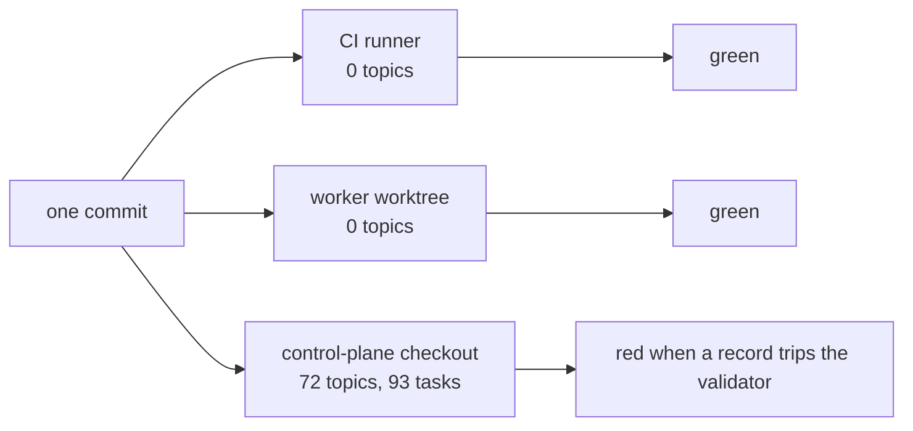

# Fleet's testing, against firstmate's

> **Status: analysis for review.** No test code and no CI change land with this
> document. It sits beside `docs/design/rust-port.md` (#79), which uses the
> existing selftests as the conformance suite for a port, so every
> recommendation below says whether it belongs in today's fleet or in that
> port.

The short version: firstmate's testing is built for 204 test scripts and a
serial lane that outgrew one CI runner. Most of that machinery answers a scale
fleet does not have. What fleet is missing is smaller and was paid for this
week: its gate reads the operator's live queue instead of fixtures, so the same
commit is green in CI and red on the control plane; real records never go
through the code; CI runs ten of the gate's fourteen checks; and stubs agree
with fleet where thurbox does not.

Every firstmate path below is from `kunchenguid/firstmate` `main` at `b518a25`
(2026-09-12), not from a fork branch. Every fleet path is from `main` at
`5bc7a1a`.

## 1. Side by side

| | firstmate | fleet |
|---|---|---|
| Size | 204 `tests/*.test.sh` plus one `tests/fm-backend-herdr-eventwait.test.py` (stdlib `unittest`) | 7 selftests: `queue-selftest.sh` (6,248 lines), `onboarding`, `fleet-status`, `reconcile`, `install`, `sync`, `pane`, plus the `pane_harness.lua` renderer |
| Layout | Library code split into `bin/*-lib.sh`; one test script per subject, `tests/<subject>.test.sh`; shared helpers in `tests/lib.sh`, `tests/fixtures.sh`, `tests/git-config-helpers.sh` | One selftest per entry point, `scripts/<name>-selftest.sh`, each self-contained with its own `pass`/`fail`; fixtures in `scripts/fixtures/{glab,layout}` |
| Runner | `bin/fm-test-run.sh` (2,565 lines): families, lanes, `--changed`, bounded `--jobs` admitted only for scripts proven isolated by `bin/fm-test-isolation-proof.sh` | `scripts/check.sh` calls each selftest; no runner, no selection below the check |
| Output | TAP-style `ok - <name>` per case; machine markers `FM_TEST_BEGIN`/`FM_TEST_END`/`FM_TEST_SUMMARY`; a JSON timing artifact per lane (`--json`) | Coloured `ok`/`FAIL` per case; a failing selftest is re-run visibly by `check.sh` |
| Sharding | Two duration-balanced parallel lanes and five serial shards (`Behavior portable serial 1`–`5`), packed longest-first from measured hints (`docs/fm-test-portable-shards.md`); `Test coverage guard` proves the lanes partition the inventory | None; one CI job per check |
| Skips | A `skip:` line is a counted, recorded `skipped_gate`; `--fail-on-gate-skip <token>` turns a named skip into a failure in CI | A missing tool fails the check (`check.sh` header). A skip inside a selftest prints `skip` and passes (`sync-selftest.sh` around line 177) |
| Real dependencies | Required `Behavior tests (Herdr)` lane: Herdr pinned at 0.7.4, protocol floor 16, a headless default session, lab sessions snapshotted and torn down. Serial shards `::error::` when tmux is absent | Every external CLI is stubbed on `PATH`: `thurbox-cli`, `gh`, `glab`, `ssh`, `quota-axi`, a fake PowerShell host for psmux. No lane runs real thurbox |
| Flakes | No retries. Every job has `timeout-minutes` as a hang tripwire, enforced by `tests/fm-ci-workflow.test.sh`; polls count iterations rather than wall time (`CONTRIBUTING.md`); a headless-Chrome start-up flake is written down as one (`docs/calm-mode-feasibility.md`) | No retries. No `timeout-minutes` on any job, so GitHub's default applies |
| Platforms | Linux for every lane; `Stock macOS Bash snapshot compatibility` parses every shell file under `/bin/bash` 3.2.57 and runs three suites. Windows is `windows-herdr-spike.yml`, `workflow_dispatch` only, and `tests/fm-pi-windows-shell-invocation.test.sh` skips unless Node reports `win32` | Linux only. macOS's missing `timeout` is reproduced by a sandboxed `PATH` (`sync-selftest.sh`); Windows by a fake PowerShell host (`queue-selftest.sh` §11(i)) |
| CI structure | `ci.yml`: `Lint`, `Test coverage guard`, two parallel lanes, the serial matrix, the Herdr lane, `Behavior timing aggregate`, the macOS job, `Repo invariants`. `no-mistakes-required.yml`: `PR must be raised via no-mistakes` | `ci.yml`: a `Detect changes` paths filter, one job per check, `All Checks` as the single required status |
| Enforcement | CI on push to `main` and on pull requests; `bin/fm-lint.sh` is the pre-push lint; `.no-mistakes.yaml` runs it; every contributor PR must carry a no-mistakes attestation for its head | CI on pull requests only, while routine changes go straight to `main`; `.no-mistakes.yaml`'s `lint` runs the whole `check.sh`; prek runs five checks |
| Isolation | Every script runs isolated from the host's global and system Git configuration; the runner refuses to execute in the primary checkout when `FM_TASK_ID` marks a worker | `FLEET_QUEUE_DIR`, `FLEET_RECONCILE_DIR` and a throwaway `HOME` per selftest; `GIT_CONFIG_*` pinned in three of the seven selftests. `check.sh queue` also reads the checkout's own live queue (§2.2) |
| Duration | The serial remainder alone was ~63 minutes by 2026-09-01 (`docs/fm-test-portable-shards.md`) | The whole gate ran in 283 s on the operator's machine on 2026-09-13: `queue` 176 s, `reconcile` 87 s, `shell` 9 s, every other check under 4 s |

## 2. The gaps, ranked by what they would have caught

Cost is stated as what the fix adds, not as effort.

### 2.1 Real records are not fixtures

**Missing.** Nothing puts a record an older fleet wrote through newer code. The
control plane's queue holds 93 task records across 72 topics, and their
top-level keys fall into at least twelve distinct sets: `host`, `publish`,
`watch_from`, `shepherd` and `artifact_check` each arrived partway through that
history. The selftests build every record they read with today's `queue.sh
add`, so each test proves only the current shape.

**Incidents.**

- #74 renamed the publish method `no-mistakes` to `attested`. The reader
  folded the alias; `cmd_check` compared the raw word, and 23 archived records
  failed the gate on the operator's checkout.
- #78 fixed that instance and added selftest case (f2): one synthesised record
  with the old word. It covers that spelling, not the class.
- 15 records could only be closed with `collect --allow-unverified`. Nothing
  replays a real record through `collect`, so which shapes `collect` cannot
  verify is found by the operator.

**Fix.** Sanitised copies of every record shape that shipped, under
`scripts/fixtures/records/<shape>/`, and a selftest section that copies them
into a throwaway `FLEET_QUEUE_DIR` and runs `check`, `list`, `show` and
`collect` against them with the forge stubbed. `collect` has no dry-run, which
is why it runs on a copy. A rename then fails a fixture before it fails an
archive.

**Costs.** A sanitising pass over the records — this repository is public, and
records name repositories, branches, session names and pull request URLs — and
one selftest section. No new dependency.

**Now.** `rust-port.md` §2.2 item 6 already names this directory as the port's
test input, and §7 round-trips every fixture through both implementations.
Fixtures are data, so building them now costs the port nothing and gives it
its corpus.

### 2.2 The code gate reads the operator's live state

**Missing.** `check.sh queue` runs `./scripts/queue.sh check` before the
selftest, and `queue_root()` is the queue of the checkout the script lives in
(`checkout_root()` anchors on `__file__`, by design since #11). So the answer
depends on where the gate runs, measured on 2026-09-13:

That settles the isolation question the brief raised: run in a worker's
worktree, `check.sh` does **not** validate the live queue. It validates that
worktree's empty `orchestration/queue/`, and CI validates another empty one.
The only checkout where this half of the check means anything is the one where
a failure is about the operator's data rather than the change under review.
`check_automerge` has the same shape: it answers `skip` when the checkout holds
an operator's `auto-merge.conf`.

**Incident.** #74 again: a gate that ran on fixtures would have gone red in the
pull request; this one went green in CI and red on the operator's next local
run, on records nobody had touched.

**Fix.** Split the two questions. The code gate validates §2.1's fixtures. The
live `queue.sh check` becomes an operator health check — `fleet-status.sh` and
`update-fleet` are where an operator already looks after a sync — where a
failure reads as "your records need attention", not "this commit is broken".
While there, pin `GIT_CONFIG_*` in the selftests that build repos without it,
as `queue-selftest.sh` does and firstmate's `tests/git-config-helpers.sh` does
for every script.

**Costs.** Moving one call out of `check_queue` and into the status command.

**Now.** It is a change to `check.sh`, and `rust-port.md` does not port
`check.sh`; its `fleet queue check --corpus <dir>` is the same split.

### 2.3 CI runs less than the gate it stands for

**Missing.** `check.sh` runs fourteen checks. CI has jobs for ten of them:
`status`, `voice`, `automerge` and `sync` have no job, so `All Checks` cannot
need them. Of the jobs that exist, the paths filters miss files their
selftests drive: the `queue` filter omits `scripts/lib/forge.py`, which §13
and §14 of `queue-selftest.sh` exercise, and `scripts/session-trust.sh`, which
its test 9 runs for real; the `reconcile` filter omits
`scripts/lib/notify_lead.py`. prek runs five checks. And the markdown check is
not the same check in both places: CI pins rumdl 0.2.67, this machine has
0.2.4.

The `ci.yml` header and `AGENTS.md` both say a green local run and a green
pull request mean the same thing. On those four checks, those filters and that
linter, they do not.

**Incident.** #67 — `timeout` is absent on stock macOS, so `sync-checkout.sh`
reported every Mac session's origin unreachable. `sync-selftest.sh` exists
because of it, and no CI job runs it: a pull request that regresses the fix
passes CI.

**What firstmate does.** `Test coverage guard` runs `bin/fm-test-run.sh
--check-coverage`, which fails when the lanes do not partition the whole test
inventory, and `tests/fm-ci-workflow.test.sh` parses `ci.yml` as YAML rather
than grepping it.

**Fix.** The simplest one first: run the whole gate in CI, without paths
filters. The measured duration above is what that costs per pull request. If
that is too slow, a check in `check.sh` that loads `ci.yml` with PyYAML — which
the gate already requires — and fails when a check in `check.sh`'s list is run
by no job. Pin rumdl in one place both read.

**Costs.** CI minutes, or one Python check. No new dependency either way.

**Now.** `check.sh` and `ci.yml` stay through the port and gain `cargo` jobs
there, so the rule carries over.

### 2.4 Stubs that agree with fleet where thurbox does not

**Missing.** Every stub is hand-written from what fleet expects, so it accepts
what fleet sends. `install-selftest.sh` stubs `thurbox-cli` because "a
throwaway HOME does not isolate it".

**Incidents.**

- #76 — a remote spawn passed `--parent`, which thurbox refuses across hosts.
  Every remote dispatch was impossible; the stub accepted it.
- #70 — thurbox refuses a session name over 64 bytes. The cap is now measured
  against thurbox 2.19.5 and mirrored in `queue.py`, but a stub cannot notice
  thurbox moving it.
- #80 — psmux captures a pane with its spaces removed, so the trust dialog went
  unseen on a real Windows host. The fake PowerShell host now reproduces that,
  after the fact.

**What firstmate does.** A required real lane for the one dependency that
matters most (Herdr, pinned, with a protocol floor, lab sessions snapshotted and
torn down), and `--fail-on-gate-skip 'herdr not found'` so a missing pin cannot
pass as a skip.

**Found while checking.** `thurbox-cli` 2.22.0 honours `THURBOX_CONFIG_DIR` and
`THURBOX_DATA_DIR`: with both pointed at a scratch directory, `plugin dir`
answered from there and the database was created there. That was verified for
those two paths only — not for `extension install`, session creation or the
server socket, which is what the stub is protecting the operator from.

**Fix, in two steps.**

1. **Recorded, not written, stub output.** Capture the `thurbox-cli` output
   fleet parses — `session list --json`, `session get --json`, the `watch`
   stream, and the refusals from #70 and #76 — from the floor
   (`min_thurbox_version = "2.19.0"` in `extension.toml.in`) and from the
   current release, and have the stubs replay those files. Same for psmux
   captures.
2. **One real-thurbox lane**, once those variables are shown to isolate
   sessions as well as files: pinned thurbox and tmux on the runner, a
   dispatch of one task against a local bare repo, `--fail`-on-absent like
   firstmate's tmux step.

**Costs.** Step 1: a capture script and the fixtures it writes. Step 2: a
pinned thurbox install in CI and proof of isolation first; if the variables do
not isolate sessions, a change in thurbox.

**Now for step 1; step 2 either side of the port.** `rust-port.md` §4 already
calls for "a contract test [that] parses output recorded from the oldest and
the newest supported `thurbox-cli`". The recordings are that test's input, so
they carry over. A real-thurbox lane drives fleet from outside and is neutral
between implementations, so it is not thrown away either, but it is the most
expensive item here and should follow step 1.

### 2.5 `queue.py` is tested only through the CLI

**Missing.** 6,846 lines and 192 top-level definitions, reached only through
`queue.sh`. Functions that decide — `publish_method`, `publish_verdict`,
`parse_result`, `classify`, `parse_auto_merge`, `blocker_kind`, `task_floor` —
are tested by building a queue on disk around them.

**Incident, and why it ranks here.** #74 is the obvious candidate and a unit
test would not have caught it: `publish_method()` was correct, and the bug was
that `cmd_check` did not call it. What catches that class is §2.1's fixtures,
or normalising once at read time, which is `rust-port.md` §2.2. No incident
this week needed a unit test to catch it.

**Fix.** In the port, not in Python. `rust-port.md` §7 plans unit tests for
`records` with migration and alias fixtures, `insta` snapshots and `trycmd`
help examples. A Python unit suite now would test code the port retires writer
by writer.

**The one exception, now.** The alias table the port turns into data (`field`,
`old`, `new`, `since`) lands in `queue.py` first as §7 prep item 3. Test it as a
table — one row, one fixture — and the test is data both implementations read.

**Costs.** Nothing now beyond that table test.

### 2.6 A skip passes silently

**Missing.** `check.sh` fails when a tool is missing, which is the part of
firstmate's `--fail-on-gate-skip` that matters most. Inside a selftest, a skip
still passes: `sync-selftest.sh` skips its coreutils-parity case on a host with
neither `timeout` nor `gtimeout`, and the `Onboarding` job installs lua only
because `place-pane.sh`'s read-back "silently skips" without it. Nothing counts
or reports them.

**Incident.** None yet. It ranks here because it is how a gate reads green
with a case unrun, which is the failure `check.sh`'s header calls worse than no
gate.

**Fix.** A skip prints one `skip:` line with its reason; `check.sh` counts
them; CI fails on any.

**Costs.** A convention and a count in `check.sh`.

**Now.** Shell conventions stay while the bash suite is the conformance suite.

### 2.7 Platforms

**Windows.** Faked, by the PowerShell host in `queue-selftest.sh` §11(i).
Firstmate does not do better: its Windows workflow is a manual measurement
spike, and its one native-Windows test skips on every CI runner.
`rust-port.md` §8 says fleet runs on Windows under WSL, and native Windows can
only arrive once Python is retired. So a Windows CI lane now would test a
support claim fleet does not make. **Port**: build `x86_64-pc-windows-msvc` in
CI from the start, as §8 says. **Now**: keep real psmux captures as fixtures,
under §2.4's step 1.

**macOS.** #67 was a macOS-only failure, caught by the operator. The sandboxed
`PATH` in `sync-selftest.sh` now reproduces it on Linux, which is cheaper than
firstmate's `macos-latest` job and covers the same class for that script. The
gap is that CI never runs it (§2.3). **Now**, nothing beyond §2.3. The
scripts a Mac runs before any dependency — `install.sh` and
`sync-checkout.sh` — stay shell after the port, so a macOS job would survive
it if a second incident asks for one.

### 2.8 No hang bound on CI jobs

**Missing.** No job in `ci.yml` sets `timeout-minutes`, and
`reconcile-selftest.sh` starts a real supervised loop under `setsid` and waits
on it. Firstmate added a bound to every job after its 2026-09-12 Actions
starvation incident, and `tests/fm-ci-workflow.test.sh` keeps them there.

**Incident.** None in fleet.

**Fix.** `timeout-minutes` on each job, well above its measured duration.

**Costs.** One line per job. **Now.**

## 3. Now or the port

| Gap | Where | Why there |
|---|---|---|
| 2.1 Records as fixtures | Now | Data; `rust-port.md` §2.2 and §7 consume it |
| 2.2 Gate off live state | Now | `check.sh` is not ported; the port's `--corpus` is the same split |
| 2.3 CI runs the whole gate | Now | `ci.yml` stays and gains jobs |
| 2.4 Recorded stub output | Now | Input to the port's §4 contract test |
| 2.4 Real-thurbox lane | After recorded output, either side of the port | Implementation-neutral; needs isolation proven first |
| 2.5 Unit tests | Port | Python is retired writer by writer; only the alias table test now |
| 2.6 Counted skips | Now | Bash suite stays the conformance suite |
| 2.7 Windows | Port | Native Windows needs Python gone; WSL until then |
| 2.7 macOS | Neither, yet | Covered by 2.3 until a second incident |
| 2.8 Job timeouts | Now | One line each |

## 4. What not to copy

- **The runner** — `bin/fm-test-run.sh`'s families, lanes, longest-first
  packing, timing hints, aggregate artifacts and `--jobs` admission, with
  `bin/fm-test-isolation-proof.sh` behind it. It exists because firstmate's
  serial remainder grew past a 20-minute job cap
  (`docs/fm-test-portable-shards.md`). Fleet has seven selftests and a
  283-second gate, 176 seconds of it one file. Sharding is a `cargo test`
  concern after the port, not a bash runner to write before it.
- **`Require no-mistakes`.** Fleet is agnostic about the publishing tool by
  rule — `check.sh automerge` fails a tracked file that names one — so a CI
  check requiring a named tool contradicts the gate. `collect` already compares
  an attested head to the pull request's head (`POLICY.md`). And CI here only
  sees the minority of changes that open a pull request.
- **Ruby for YAML.** `tests/fm-ci-workflow.test.sh`, `fm-nm-test-contract.test.sh`
  and `fm-test-run.test.sh` shell out to `ruby -ryaml`. Fleet's gate already
  requires Python with PyYAML (`scripts/lib/check_yaml.py`); §2.3's check
  belongs there.
- **Headless Chromium.** `tests/fm-calm-pi-extension.test.sh` renders a Pi Calm
  export in Chrome, and flaked on start-up. Fleet has no browser surface; its
  one UI is Lua, rendered offline by `scripts/lib/pane_harness.lua`.
- **A real lane per backend.** Firstmate supports Herdr, tmux, zellij, cmux and
  Orca, and needs a lane for each it cannot fake. Fleet drives one layer,
  thurbox, so §2.4's single lane is the whole of it.
- **The Windows spike workflow.** It measures primitives by hand. It is not a
  test, and fleet makes no native-Windows claim for it to check.

## Versions checked

Checked on 2026-09-13 against the sources named.

| What | Version | Source |
|---|---|---|
| firstmate `main` | `b518a25`, 2026-09-12 | `git clone --branch main https://github.com/kunchenguid/firstmate` |
| thurbox-cli | 2.22.0 installed; floor 2.19.0 | `thurbox-cli --version`; `extension.toml.in` |
| rumdl | 0.2.73 latest; 0.2.67 pinned in fleet CI; 0.2.4 on this machine | GitHub releases `rvben/rumdl`; `ci.yml` `RUMDL_VERSION`; `rumdl --version` |
| ShellCheck | 0.11.0 latest, installed, and firstmate's pin | GitHub releases `koalaman/shellcheck`; `bin/fm-lint.sh --required-version` |
| actionlint | 1.7.12 latest and firstmate's pin | GitHub releases `rhysd/actionlint`; `bin/fm-lint-workflows.sh --required-version` |
| prek | 0.5.2 latest and installed | GitHub releases `j178/prek`; `prek --version` |
| no-mistakes | v1.72.0 latest; v1.57.0 installed | GitHub releases `kunchenguid/no-mistakes`; `no-mistakes --version` |
| Herdr | 0.7.4, firstmate's CI pin | `bin/fm-install-herdr.sh` |
| Bash on macOS | 3.2.57, firstmate's stock-Bash assertion | `ci.yml` `macos-stock-bash` |
