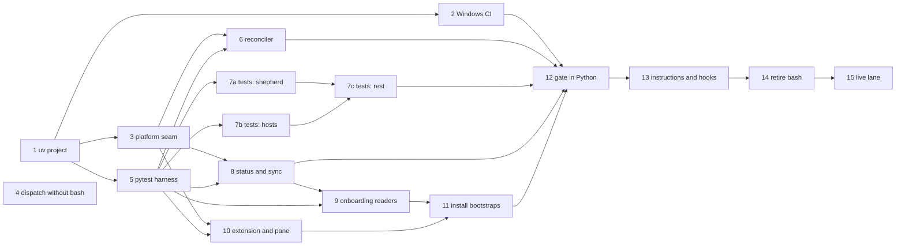

# Fleet on native Windows — a measured plan

**Goal.** A Windows operator installs fleet, runs Mission Control, and the
whole loop works without WSL or Git Bash: dispatch, watch, collect, shepherd,
reap, refuel, the reconciler, the pane, onboarding and the gate.

**Decision.** Python everywhere, run through `uv`. Retire bash one file at a
time, keep fleet as source, and add a `windows-latest` CI job that grows with
each retired file until it runs the whole gate.

**Why.** On `windows-hp`, fleet's Python core ran unmodified: every queue verb
tried, the status reader, the profile checker and the pane harness. Every
failure was at a bash seam or a platform difference, and each has a small fix
(§3).

This doc supersedes the Windows answer in `docs/design/rust-port.md` (PR #79,
draft), §8 and §10: "WSL is how fleet runs on Windows" and "native Windows can
only arrive with step 5". Native Windows arrives through Python, without the
Rust port. The ideas from that doc that carry over are the `HostShell` seam
(#80, #84), a lock instead of a pid for liveness, and CRLF-tolerant readers.

## 1. How this was measured

- **Host.** `windows-hp`: Windows 10.0.26200, Windows PowerShell 5.1.26100,
  reached with `ssh windows-hp`. The ssh session is **elevated** (a member of
  Administrators), so a symlink that worked there proves nothing about a normal
  operator account. Output passed through a non-interactive ssh console, whose
  code page (`ibm850`) is not what Windows Terminal uses.
- **Clone.** `git clone https://github.com/Thurbeen/fleet.git
  $HOME\code\fleet`, at `e6ae710` (#89).
- **Present before.** Git for Windows 2.55.0, gh 2.95.0, thurbox-cli 2.20.0,
  psmux 3.3.6 (`tmux -V` answers the same through its shim), Claude Code
  2.1.270, OpenSSH_for_Windows 9.5p2. A WSL Ubuntu distro is installed, which
  is why `bash` exists at all.
- **Installed for this plan.** uv 0.12.13, CPython 3.13.15 and 3.14.7, Lua
  5.4.6 and rumdl 0.2.69. §6 has the commands.
- **Size.** Bash: 28 files, 16,648 lines, of which 11,410 are the `*-selftest.sh`
  files. Python: 6 files, 10,815 lines. Counted with `wc -l` on `e6ae710`.
- **Invocation.** A Python row means `uv run --no-project --python <v> --with
  pyyaml python scripts/lib/<module>.py <args>`. Queue writes used a throwaway
  `FLEET_QUEUE_DIR` and `FLEET_RUNS_DIR` under `%TEMP%`.
- **Probes.** OS behaviour was checked with small Python probes under
  `$HOME\fleetprobe` on the host. Those stay there, as the brief requires.
- **Not run, on purpose.** The thurbox install, a real `dispatch` (which would
  start a worker on the operator's Claude login), `extension install`, and
  anything touching running sessions.

## 2. Measurements

"Native" means the command was started from PowerShell with nothing but the
tools listed above.

### Entry points

| Entry point | Depends on | Observed natively |
|---|---|---|
| `install.sh` | POSIX `sh`, curl, sed, jq, lua, thurbox-cli | **Does not start.** `sh` is not on PATH; Git's `sh.exe` exists but is not on PATH |
| `scripts/*.sh`, `scripts/lib/*.sh` (28) | bash, coreutils, jq, awk, sed | **Not native.** `.\scripts\queue.sh list` hands the file to `git-bash.exe` (`assoc .sh` → `sh_auto_file`) and returns at once. `bash` is `C:\WINDOWS\system32\bash.exe`, which opens the WSL Ubuntu distro (kernel `6.18.33.2-microsoft-standard-WSL2`) |
| `scripts/queue.sh` wrapper | bash, `python3` | `python3` is the Microsoft Store alias: exit 9009, "Python was not found" |
| `queue.py` `root`, `list`, `plan`, `check`, `show` | Python ≥ 3.11 (`tomllib`), PyYAML | **Works** on 3.13.15 and 3.14.7 |
| `queue.py` `topic add`, `add`, `block` | same | **Works.** The records are written with **CRLF**: `task.yaml` had 34 CRLF pairs, `PROMPT.md` 1 |
| `queue.py` `dispatch --dry-run` | thurbox-cli, `session-flags.sh`, `session-trust.sh` | **Works**, including the brief-scaffold refusal and a blocked task held back. It prints `./scripts/session-trust.sh <uuid>`, which cannot run here |
| `queue.py` `dispatch` (real) | same | **Unmeasured.** From code plus a probe, it breaks two ways. `profile_flags` catches the `OSError` (WinError 193, "not a valid Win32 application") and returns `[]`, so the task's profile is dropped without a word. `trust_and_send` does not catch it, so dispatch raises after `session create`, leaving a session with no brief |
| `queue.py` `watch --for-secs 3` | `thurbox-cli watch --json` | **Works** ("no task has a session attached yet"). Its test override `FLEET_QUEUE_WATCH_CMD` runs `sh -c`, which raises `FileNotFoundError` |
| `queue.py` `collect --no-reap` | gh | **Works** on an empty result set. No pull request was checked |
| `queue.py` `reap`, `refuel` (`--dry-run`) | thurbox-cli, quota-axi | **Work** with nothing to act on. quota-axi is not installed |
| `queue.py` `shepherd --dry-run` | gh or glab, git | **Works** with no forge repo recorded. No pull request was checked |
| `fleet_status.py` | thurbox-cli, gh, quota-axi | **Works**, exit 0. `—` prints as `�` because stdout is `cp1252`; with `PYTHONUTF8=1` it prints `—` |
| `notify_lead.py --help` | thurbox-cli | **Works.** The send path is unmeasured |
| `session_profiles.py --check`, `default` | PyYAML | **Work** ("profiles ok: 5") |
| `check_yaml.py` | PyYAML | **Works** |
| `forge.py` | gh, glab | Imported by every `queue.py` run above. No forge call was made; glab is not installed |
| `reconcile.sh` | `setsid`, `disown`, `kill -0`, `ps -o args=`, `tail -f` | **Cannot run.** See the process rows below |
| `check.sh` | bash, shellcheck, rumdl, python3, lua, jq | **Cannot run.** Its parts: `rumdl check` over `git ls-files '*.md'` gave "No issues found in 14 files"; shellcheck and jq are not installed |
| `pane-selftest.sh` → `pane_harness.lua` | lua ≥ 5.4 | The harness itself **works**: `lua scripts/lib/pane_harness.lua 48` and `… 48 --marks` exit 0 and draw the pane |
| `interface/fleet_queue.lua` | thurbox's Lua runtime | `thurbox-cli plugin check` loads the installed interface, `ok: true`. Fleet's pane was not installed, to leave thurbox untouched |
| `extension.toml.in`, `install-extension.sh` | sed, jq, thurbox-cli, `[[symlinks]]` | **Not run.** In thurbox's source (`src/session_ops/extensions/fs.rs`), a symlink that fails for lack of privilege falls back to a junction for a directory and a **hard link** for a file |
| `place-pane.sh`, `pane-ask.sh` | bash, lua, thurbox-cli | Not run natively (bash). The layout lives at `%APPDATA%\thurbox\ui`, per `thurbox-cli plugin dir` |
| `.claude/settings.json` SessionStart hook | bash syntax (`$(…)`, `[ -x ]`, `\|\|`) | PowerShell 5.1 rejects `\|\|` ("not a valid statement separator"). The shell Claude Code uses for hooks on Windows is **unmeasured** |
| thurbox's `hooks\claude.json` | `thurbox-cli session signal … \|\| true` | Present at `%APPDATA%\thurbox\hooks`. Whether a native worker's hooks fire and report state is **unmeasured** |

### Platform facts

| Fact | Observed natively | How |
|---|---|---|
| thurbox's config directory | `%APPDATA%\thurbox`, holding `hosts.toml` and `hooks\`. `~\.config\thurbox` does not exist | listing; `src/paths/mod.rs:176` |
| fleet's idea of that directory | `C:\Users\thurbox/.config/thurbox`: **wrong** (`queue.py:2247`, `reconcile.sh hook`, three skills) | `os.path.expanduser` |
| `.claude/skills` on a default clone | A plain file containing `../.agents/skills`; `is_dir` False. Git's system gitconfig sets `core.symlinks=false` | `Get-Item`, `git config --show-origin` |
| `.claude/skills` with `git -c core.symlinks=true clone` | A real `SymbolicLink` (elevated session) | `Get-Item .LinkType` |
| Directory junction | Created and listed | `New-Item -ItemType Junction` |
| Line endings on checkout | `i/lf w/crlf`; system gitconfig sets `core.autocrlf=true`; no `.gitattributes` | `git ls-files --eol` |
| stdout encoding | `cp1252`, `utf8_mode=0` | probe |
| `fcntl`, `pty`, `termios`, `resource` | absent | probe |
| `os.setsid`, `os.fork`, `os.killpg`, `os.getpgid` | absent | probe |
| `signal.SIGKILL`, `SIGHUP` | absent; `SIGTERM`, `CTRL_BREAK_EVENT` present | probe |
| `os.replace` onto a file another handle holds open | `PermissionError: [WinError 5] Access is denied`; succeeds once closed | probe |
| `msvcrt.locking(LK_NBLCK)` from a second handle | refused with `PermissionError` while the first holds it | probe |
| Child with `DETACHED_PROCESS \| CREATE_NEW_PROCESS_GROUP` | **Died** when the ssh session ended: no heartbeat after the spawn | heartbeat file |
| Same, plus `CREATE_BREAKAWAY_FROM_JOB` | **Survived** the session; still beating 68 s later | heartbeat file |
| `Start-Process -WindowStyle Hidden` child | Wrote no heartbeat at all | heartbeat file |
| Overhead: `uv run --no-project --with pyyaml … queue.py plan` | 247 ms warm (3.13), 473 ms warm (3.14) | `Measure-Command` |
| Overhead: uv project console script | `uv run fleetprobe`: 409 ms warm, 631 ms cold (venv created). `uv run --project <dir>` from another cwd: 189 ms. The generated `.venv\Scripts\fleetprobe.exe` run directly: 147 ms | `Measure-Command` |
| Overhead: PEP 723 inline metadata | `uv run --script`: 336 ms cold, 359 ms warm | `Measure-Command` |

## 3. The route

**Confirmed: Python everywhere, through uv.** The operator's criteria, against
what was measured:

- **Cross-platform.** Fleet's own 10,815 lines of Python ran natively with no
  edit. The only breaks were calls out to bash and three platform behaviours:
  CRLF on write, the console code page, and the config path. The alternatives
  start by rewriting all of it.
- **Low overhead.** A verb costs about 150 to 470 ms of startup, depending on
  the entry path. It runs next to `gh` and `thurbox-cli` calls that take longer
  than that.
- **No shipped binary.** Fleet stays source. uv writes a small `fleet.exe`
  launcher into `.venv\Scripts` on the operator's own machine; nothing is
  built or released by fleet.
- **Easy setup.** `winget install astral-sh.uv`, then `uv run` fetches Python
  and PyYAML (§6). uv is already the operator's standing choice for Python.
- **Agents are good at it.** Python is the language the core is already
  written in.

**Packaging: one uv project, not inline metadata per file.** The modules load
each other through `importlib.util`, so one `pyproject.toml` with a `fleet`
console script and a committed `uv.lock` pins PyYAML once; Renovate updates a
`uv.lock` directly. Records stay YAML. `task.yaml` is a contract with every
queue already on disk, so moving to JSON would be a migration with nothing
gained. Typing is optional and checked only in the gate: `ruff` first,
`pyright` later, both pinned in a uv dev group.

**Deno + TypeScript is not chosen.** It would mean rewriting 10.8k lines of
Python that already work natively, on top of the bash. It was not installed or
measured.

## 4. Platform seams

Each seam gets one function in a `fleet/platform.py` module, with a POSIX
branch and a Windows branch and tests that run on both CI runners. Callers
never branch on `os.name` themselves.

| Seam | Today | Native plan |
|---|---|---|
| **Scripts** | 193 `./scripts/*.sh` references across FLEET.md, AGENTS.md, README, the skills, POLICY.md, playbooks and hooks. `queue.py` itself calls `./scripts/session-flags.sh` and `./scripts/session-trust.sh` | Every verb becomes `uv run fleet <group> <verb>`. On POSIX, each retired `.sh` stays as a two-line forwarder (`exec uv run fleet …`) until the instructions stop naming it, then goes. `queue.py`'s two shell-outs become function calls, which also fixes the silently dropped profile and the uncaught crash |
| **Multiplexer** | Fleet reaches psmux or tmux only through `thurbox-cli` locally, and through `HostShell` for remote hosts (#80, #84) | No new seam. The `session-trust` port keeps #84's rules: whitespace-insensitive matching, and `Enter` alone when "Yes" is already selected. `HostShell` is reused unchanged. A native lead dispatching to a POSIX host goes through Windows' OpenSSH, which is **unmeasured** |
| **Hook status** | `reap` releases only a session it saw at rest; `refuel` reads a stale `working` | Depends on thurbox. #80 found hooks off on remote psmux hosts (`remote_hooks.rs:211`: "hook commands run through `sh`"). Whether hooks fire for a **local** native session is unmeasured, and the live lane (task 15) measures it. If they do not fire, native reap and refuel degrade to what #80 recorded, and the fix belongs in thurbox |
| **Process supervision** | `setsid "$SELF" supervise &`, `disown`, a pidfile, `kill -0` plus `ps -o args=`, `kill -TERM -- -pgid` | Liveness is an exclusive lock on `reconcile/lock` that the loop holds (`fcntl.flock` or `msvcrt.locking`): a dead loop holds no lock, so no stale pid needs checking. The pidfile stays for people. Start: `Popen` with `start_new_session=True` on POSIX, and `DETACHED_PROCESS \| CREATE_NEW_PROCESS_GROUP \| CREATE_BREAKAWAY_FROM_JOB` on Windows, the only measured variant that survived its parent session. Stop: the existing `down` flag first, which the loop polls, then `os.kill(pid, SIGTERM)`, which is `TerminateProcess` on Windows. Never `os.kill(pid, 0)` as a liveness probe: on Windows 0 is `CTRL_C_EVENT` (Python docs; unmeasured) |
| **Atomic writes** | `open(tmp, "w")` then `os.replace` (`queue.py:1038`, `:6597`) | One `write_record()` that writes with `newline="\n"` and retries `os.replace` on `PermissionError` with a short bounded backoff, since a reader holding the file open fails it on Windows. `open(..., newline=…)` is used nowhere today, which is why records came out CRLF |
| **File locking** | None in the queue | Same lock helper as supervision. A queue lock is only introduced where a real race is shown, not as part of the port |
| **Line endings** | No `.gitattributes`; Git for Windows checks out CRLF | Add `* text=auto eol=lf`. Writers emit `\n`; readers accept `\r\n`, as `result.md` from a Windows host already requires (#80) |
| **Console encoding** | `cp1252` stdout mangles `—`, `◐` and `🚀` | The `fleet` entry point calls `sys.stdout.reconfigure(encoding="utf-8")` and the same for stderr. `PYTHONUTF8=1` fixed it in the measurement |
| **Config and data paths** | `~/.config/thurbox/hosts.toml`, `~/.config/thurbox/hooks/claude.json`, `XDG_DATA_HOME` or `~/.local/share` | `thurbox_config_dir()` mirrors thurbox's own rule (`src/paths/mod.rs`: `%APPDATA%` on Windows) and `fleet_data_dir()` uses `%LOCALAPPDATA%`. Skills and hook text name the directory through `uv run fleet paths` rather than a literal path |
| **Symlinks** | `.claude/skills → ../.agents/skills` is tracked; a default Windows clone makes it a text file, so Claude Code finds no skills | Stop tracking it. `fleet install` creates it (a symlink on POSIX, a junction on Windows, which needs no privilege) and `.gitignore` lists it, so `sync-checkout` never sees a dirty tree. The gate checks that it resolves |
| **Extension `[[symlinks]]`** | `CLAUDE.md`, `AGENTS.md`, `GEMINI.md` → `FLEET.rendered.md` | On Windows without privilege, thurbox makes these **hard links**. A re-render that replaces `FLEET.rendered.md` with a new file leaves the links pointing at the old content. `fleet install` must write the rendered file in place, and the port verifies it with a non-elevated account. **Unmeasured** |
| **Claude Code hooks** | SessionStart is a bash one-liner; the reconciler's Stop nudge prints `$SELF nudge >/dev/null 2>&1 \|\| true` | A single command with no shell syntax, `uv run fleet sync-checkout` and `uv run fleet reconcile nudge`, which parses the same in bash, cmd and PowerShell. Tolerating failure moves inside the command, which always exits 0 |
| **Pane** | The Lua pane runs in thurbox; `place-pane.sh` edits `layout.lua` | The pane Lua is already portable (harness and `plugin check`). `place-pane` is ported to Python and finds `layout.lua` with `thurbox-cli plugin dir`, never with a literal path |
| **Install** | `curl … \| sh` into POSIX `install.sh` | Two bootstraps that only clone and hand off: `install.sh` for POSIX and `install.ps1` for `irm … \| iex`. Everything after the clone is `uv run fleet install`. Neither installs uv; both say how when it is missing |

## 5. Tests and CI

**Tests become pytest, and the stubbed-CLI approach stays.** The selftests
work because fleet runs its real entry point against fake `gh`, `thurbox-cli`,
`ssh` and `quota-axi` on PATH. That is kept, as an end-to-end suite and not as
mocks:

- **Stubs are Python.** A small `tests/stubs` project declares `gh`,
  `thurbox-cli`, `ssh`, `glab` and `quota-axi` as console scripts. The session
  fixture installs it into a throwaway venv with `uv` and puts that venv's
  `bin` or `Scripts` directory first on PATH. uv generates a real `gh.exe` there
  (the same mechanism that produced the measured `fleetprobe.exe`), so fleet's
  unchanged `subprocess.run(["gh", …])` finds the stub on Windows too. A `.cmd`
  stub would not be found: `CreateProcess` only appends `.exe`.
- **Stubs carry today's logic.** `pr-json.py`, `attest.py` and #80's
  `windows-host.py` are already Python; they move into the stub package as is.
- **Isolation is a fixture.** `selftest-env.sh` becomes the `isolated_env`
  fixture: HOME, the XDG directories and their Windows equivalents
  (`APPDATA`, `LOCALAPPDATA`), git config, forge tokens and the `FLEET_*`
  roots. `isolation-selftest.sh` becomes a test that runs the suite under a
  hostile environment.
- **Port by section, not by file.** `queue-selftest.sh` (7,313 lines) is split
  along its own numbered sections, in the order tasks 7a–7d list. Each PR ports
  some sections to `tests/queue/`, deletes them from the bash file, and leaves
  what remains passing.
- **A real-thurbox lane is optional** (task 15), manual, and run against
  `windows-hp`.

**CI enforces "supported".** A new `windows` job in `ci.yml` runs on
`windows-latest` with `actions/checkout` and `astral-sh/setup-uv` (v10.1.0 is
latest as of 2026-09-13). It runs `uv run fleet check --platform-ported`: the
checks already ported, which is exactly the set that runs natively. Every
porting task adds its check to that set in the same PR. `all-checks` requires
the job from its first PR, so a regression on Windows fails the pull request.
The last task deletes `--platform-ported`, and both runners then run the whole
gate. Once no `.sh` is left, the Linux jobs become the same matrix row.

Gate tools go through uv as well, so both runners pin them in one place:
`rumdl` and `ruff` are on PyPI (latest 0.2.73 and 0.16.7), and `pytest` 9.1.1
goes in a dev group. Lua is the one gate tool outside PyPI. How to install it
on `windows-latest` (a setup action, or Chocolatey) is **unmeasured**, and task
2 decides it with a run.

## 6. Setup on a fresh machine

What worked on `windows-hp`, in order. `winget` edits the user PATH, so open a
new PowerShell afterwards; the measurement reloaded `$env:Path` instead.

```powershell
# Already required by thurbox and the agent: Git for Windows, gh, thurbox, psmux.
winget install --id astral-sh.uv -e          # uv 0.12.13
uv python install 3.14                        # CPython 3.14.7
winget install --id DEVCOM.Lua -e             # Lua 5.4.6 — only the pane check needs it
winget install --id rvben.rumdl -e            # rumdl 0.2.69 — only the markdown check
git clone https://github.com/Thurbeen/fleet.git $HOME\code\fleet
cd $HOME\code\fleet
$env:PYTHONUTF8 = "1"
uv run --no-project --python 3.14 --with pyyaml python scripts/lib/queue.py plan
```

Notes:

- winget's Lua is 5.4.6; upstream's latest is 5.5.1. The harness needs ≥ 5.4.
- winget's rumdl is 0.2.69; CI pins 0.2.67 and PyPI's latest is 0.2.73.
  Installing it through uv (§5) removes the mismatch.

After task 1, the same machine needs only:

```powershell
winget install --id astral-sh.uv -e
git clone https://github.com/Thurbeen/fleet.git $HOME\code\fleet
cd $HOME\code\fleet
uv run fleet install
```

## 7. Order and decomposition

**Order.** Each step leaves fleet working on Linux, and each PR retires bash
only together with its tests:

1. Foundations first: packaging, CI, the platform module and the test harness.
2. Then the bash that `queue.py` itself calls, which is what breaks dispatch.
3. Then the supervisor, the leaf scripts, onboarding and the pane.
4. The gate and the instructions last, because they name every script that
   came before.

**In flight.** `stuck-task-recovery/01` is changing `scripts/lib/queue.py`.
Tasks 1, 3, 4 and 5 touch it too. That overlap is a rebase and not a blocker,
and nothing here depends on that task's internals.

| # | Task | Branch | Retires | Blocked by |
|---|---|---|---|---|
| 1 | `pyproject.toml` + `uv.lock`, a `fleet` console script dispatching to the existing modules, UTF-8 stdio, `.gitattributes`; `queue.sh` and `fleet-status.sh` forward to `uv run fleet`; preflight requires uv | `feat/uv-project` | — | — |
| 2 | Windows CI job: `setup-uv`, Lua install decided by a run, rumdl and ruff through uv. Adds `fleet check --platform-ported`, which runs the checks already in Python (yaml, profiles, queue reads, pane harness, markdown) while `check.sh` stays Linux's gate. `all-checks` requires the job | `ci/windows-job` | — | 1 |
| 3 | `fleet/platform.py`: config and data dirs, `write_record` (LF plus replace retry), lock, detached spawn, alive, with pytest on both OSes; `queue.py` uses the dirs and the writer | `feat/platform-seam` | — | 1 |
| 4 | Dispatch's shell-outs in-process: `session-flags` as a call into `session_profiles`, `session-trust` ported to Python with #84's rules, `watch` override as an argv list instead of `sh -c`; tests extend the existing bash sections until task 5 ports them | `feat/dispatch-no-bash` | `session-flags.sh`, `session-trust.sh` (forwarders kept) | — |
| 5 | pytest harness: `tests/stubs` console-script package, `isolated_env` fixture, the first ported sections (§1–§8) | `test/pytest-harness` | part of `queue-selftest.sh`, `selftest-env.sh` | 1 |
| 6 | Reconciler in Python: `fleet reconcile ensure\|start\|stop\|restart\|status\|nudge\|hook\|logs`, lock liveness, breakaway spawn, `notify_lead` unchanged; `reconcile-selftest` to pytest | `feat/reconcile-python` | `reconcile.sh`, `reconcile-selftest.sh` | 3, 5 |
| 7a | Queue tests §9–§10 (reap, shepherd) to pytest | `test/queue-shepherd` | part of `queue-selftest.sh` | 5 |
| 7b | Queue tests §11 (hosts, including #80's fake Windows host) to pytest | `test/queue-hosts` | part of `queue-selftest.sh` | 5 |
| 7c | Queue tests §12–§15 (refuel, agent seam, display, archive) to pytest; delete `queue-selftest.sh` | `test/queue-rest` | rest of `queue-selftest.sh` | 7a, 7b |
| 8 | Status and sync: `fleet-status`, `sync-checkout`, `sync-registry`, `gh-accounts`, `glab-hosts` to Python, with their selftests | `feat/sync-python` | 5 files and `fleet-status-selftest.sh`, `sync-selftest.sh` | 3, 5 |
| 9 | Onboarding readers: `preflight`, `discover-owners`, `add-owner` to Python, with Windows install hints (`winget …`) beside the POSIX ones | `feat/onboarding-python` | 3 files | 5, 8 |
| 10 | Extension and pane: `install-extension` (render in place, hard-link safe), `place-pane` (via `plugin dir`), `pane-ask`, `voice-ask`, `trust-thurbox-dir`; `pane-selftest` to pytest | `feat/extension-python` | 5 files and `pane-selftest.sh` | 3, 5 |
| 11 | Install bootstraps: `install.sh` and a new `install.ps1` both hand off to `fleet install`, which creates `.claude/skills` (symlink or junction) and untracks it; `install-selftest` and `onboarding-selftest` to pytest | `feat/install-both` | `install-selftest.sh`, `onboarding-selftest.sh` | 9, 10 |
| 12 | Gate in Python: `fleet check` owns every check, ruff replaces shellcheck, `isolation-selftest` to pytest, `.pre-commit-config.yaml` and `.no-mistakes.yaml` point at it | `feat/gate-python` | `check.sh`, `isolation-selftest.sh` | 2, 6, 7c, 8, 11 |
| 13 | Instructions and hooks: FLEET.md, AGENTS.md, README, skills, POLICY.md and playbooks name `uv run fleet …`; shell-neutral `.claude/settings.json` and nudge hook text; paths via `fleet paths` | `docs/fleet-cli-everywhere` | — | 12 |
| 14 | Delete the forwarders and drop `--platform-ported`, so both runners run the whole gate | `chore/retire-bash` | every remaining `.sh` except `install.sh` | 13 |
| 15 | Optional live lane on `windows-hp`: native lead, real dispatch, hook state, collect, reap, refuel, reconciler across a logoff; findings written into this doc | `docs/windows-live-lane` | — | 14 |



**First to dispatch.** Tasks 1 and 4 together, since neither blocks the other.
Once 1 merges, dispatch 2, 3 and 5 at once.

## 8. Open questions

- Does a local native thurbox session report hook state? This decides whether
  `reap` and `refuel` work for a native lead without a thurbox change (task 15).
- Which shell does Claude Code use for hooks on Windows? Shell-neutral hook
  commands (task 13) make the answer irrelevant to fleet, but it is unmeasured.
- Non-elevated account: symlink versus junction for `.claude/skills`, and
  thurbox's hard-link fallback for the extension. All measurements here ran
  elevated.
- A reconciler survives its ssh session with breakaway, but surviving a logoff
  or a reboot is unmeasured. Autostart stays `reconcile ensure` from the lead's
  first turn, as it is today.
